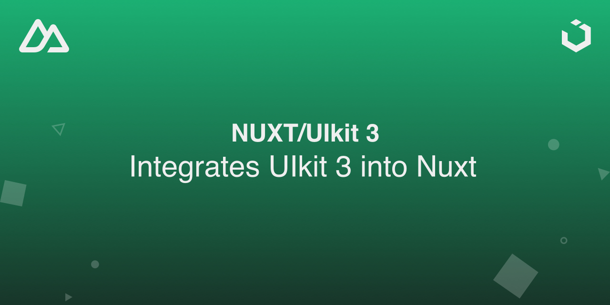

# Nuxt Uikit 3

⚠️ the package is still work in progress and will be released soon ⚠️

[![npm version][npm-version-src]][npm-version-href]
[![npm downloads][npm-downloads-src]][npm-downloads-href]
[![License][license-src]][license-href]
[![Nuxt][nuxt-src]][nuxt-href]
[![UIkit][uikit-src]][uikit-href]

Nuxt compatibility: `^3.0.0` Bridge: `false`



UIkit 3 Nuxt module

UIkit is a lightweight and modular front-end framework for developing fast and powerful web interfaces

- [✨ &nbsp;Release Notes](/CHANGELOG.md)
- [UIkit 3 Docs](https://getuikit.com/docs/introduction)
- [Nuxt Docs](https://nuxt.com/docs/getting-started/introduction)
  <!-- - [🏀 Online playground](https://stackblitz.com/github/your-org/nuxt-uikit3?file=playground%2Fapp.vue) -->
  <!-- - [📖 &nbsp;Documentation](https://example.com) -->

## Features

- Injects UIkit 3 into Nuxt ✅
- scss/less to customize UIkit 3 theme ✅
- Use all UIKit 3 JS components without writing any JS ✅
- Use UIKit 3 icons pack ✅
- UIkit 3 documentation in Nuxt Devtools ✅

### On version `1.0.0` release **todos:**
- Tests

## Quick Setup

Add `@samk_dev/nuxt-uikit3` dependency to your project

```bash
# Using npm
npm install --save-dev @samk_dev/nuxt-uikit3

# Using pnpm
pnpm add -D @samk_dev/nuxt-uikit3

# Using yarn
yarn add --dev @samk_dev/nuxt-uikit3
```

Add `@samk_dev/nuxt-uikit3` to the `modules` section of `nuxt.config.ts`

```ts
export default defineNuxtConfig({
  modules: ['@samk_dev/nuxt-uikit3']
});
```

That's it! You can now use Nuxt Uikit 3 in your Nuxt app ✨

For additional configuration please refer to module docs

## Development

```bash
# Install dependencies
npm install

# Generate type stubs
npm run dev:prepare

# Develop with the playground
npm run dev

# Build the playground
npm run dev:build

# Run ESLint
npm run lint

# Release new version
npm run release
```

<!-- Badges -->

[npm-version-src]: https://img.shields.io/npm/v/@samk_dev/nuxt-uikit3/latest.svg?style=flat&colorA=18181B&colorB=28CF8D
[npm-version-href]: https://npmjs.com/package/@samk_dev/nuxt-uikit3
[npm-downloads-src]: https://img.shields.io/npm/dm/@samk_dev/nuxt-uikit3.svg?style=flat&colorA=18181B&colorB=28CF8D
[npm-downloads-href]: https://npmjs.com/package/@samk_dev/nuxt-uikit3
[license-src]: https://img.shields.io/npm/l/@samk_dev/nuxt-uikit3.svg?style=flat&colorA=18181B&colorB=28CF8D
[license-href]: https://npmjs.com/package/@samk_dev/nuxt-uikit3
[nuxt-src]: https://img.shields.io/badge/Nuxt-18181B?logo=nuxt.js
[nuxt-href]: https://nuxt.com
[uikit-href]: https://getuikit.com
[uikit-src]: .github/assets/uikit-badge.svg
